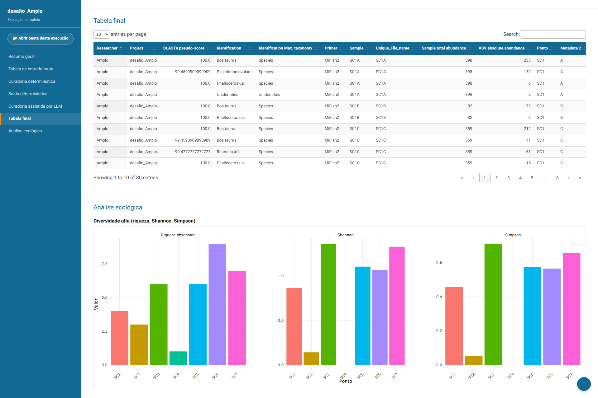
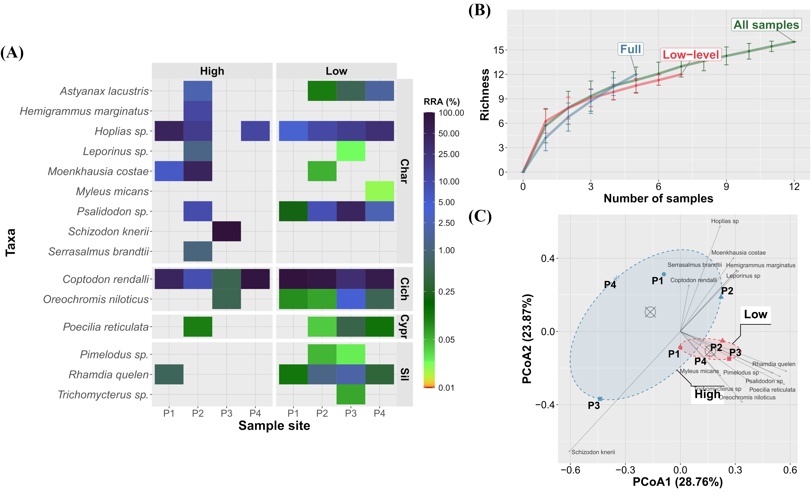
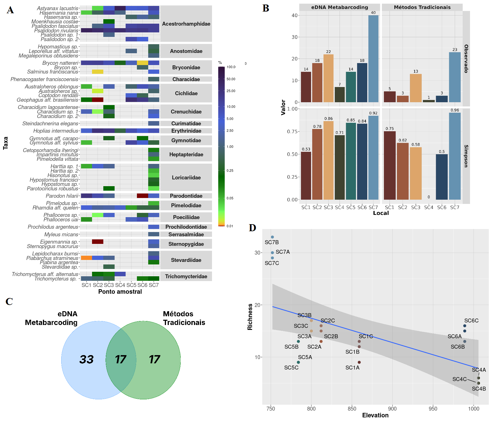
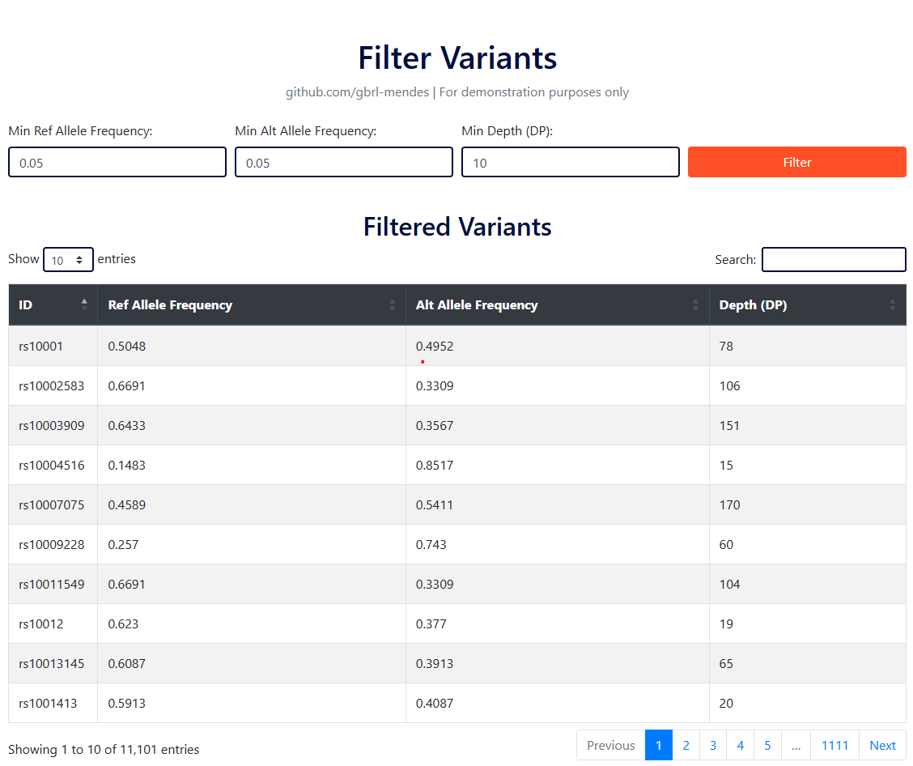
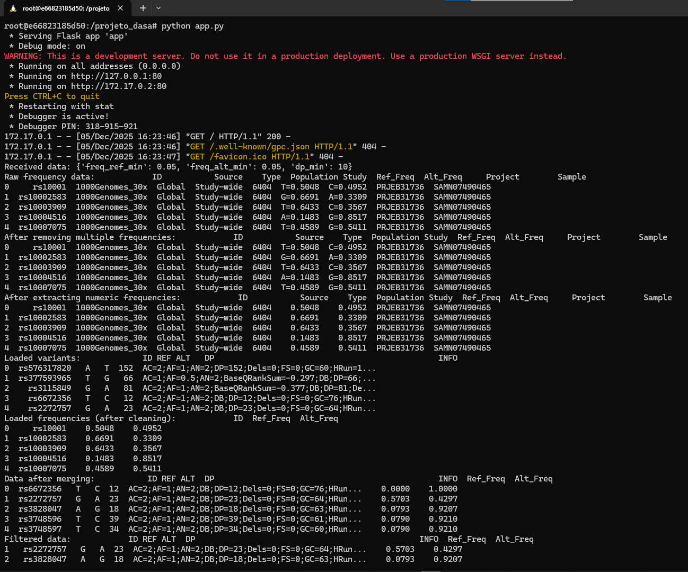

# Portfolio | Portfólio

## AI-Assisted Pipelines | Pipelines Assistidos por IA

  

    

    

      <h3><a href="software_projects/edna_llm_curation.html">Hybrid eDNA Curation: Deterministic Code + LLM</a></h3>
      
Command-line system that turns raw eDNA metabarcoding tables into a curated, auditable species database. Deterministic R code computes every fact it can; an LLM only reviews the ambiguous sequences, and its answers stay in separate columns.Sistema de linha de comando que transforma tabelas brutas de metabarcoding de eDNA em uma base de espécies curada e auditável. O código determinístico em R calcula todos os fatos possíveis; o LLM só revisa as sequências ambíguas, e suas respostas ficam em colunas separadas.

      <ul class="tags"><li>Python</li><li>R</li><li>LLM (Groq API)</li><li>pandas</li><li>pytest</li><li>Quarto</li></ul>
    

  

## Research | Pesquisa

  

    

    

      <h3><a href="research/LI_paper.html">Ingleses Lake Paper</a></h3>
      
How water-level changes shape fish eDNA richness and community composition in a Neotropical reservoir, across 4 sites and 2020 to 2022.Como as mudanças no nível da água afetam a riqueza e a composição de peixes por eDNA em um reservatório neotropical, em 4 pontos entre 2020 e 2022.

      <ul class="tags"><li>R</li><li>dada2</li><li>phyloseq</li><li>vegan</li><li>Quarto</li></ul>
    

  

  

    

    

      <h3><a href="research/eDNA_Cipo.html">Cipó River eDNA Metabarcoding Project</a></h3>
      
eDNA metabarcoding compared with traditional surveys (electrofishing and netting) to monitor fish biodiversity across 7 sites in the Cipó River basin.Metabarcoding de eDNA comparado com métodos tradicionais (pesca elétrica e redes) no monitoramento da biodiversidade de peixes em 7 pontos da bacia do Rio Cipó.

      <ul class="tags"><li>R</li><li>tidyverse</li><li>vegan</li><li>phyloseq</li><li>ggplot2</li></ul>
    

  

## Bioinformatics Freelance & Consulting | Consultoria e Freelance em Bioinformática

  

    

    

      <h3><a href="bioinformatic_freelance/dasa_project.html">Dasa Variants Project</a></h3>
      
Snakemake pipeline that annotates variants from a VCF file, served through an API and a Flask web interface with frequency and depth filters.Pipeline em Snakemake que anota variantes de um arquivo VCF, disponibilizado por meio de uma API e de uma interface web em Flask com filtros de frequência e profundidade.

      <ul class="tags"><li>Snakemake</li><li>Flask</li><li>Docker</li><li>Bash</li><li>VCF</li></ul>
    

  

  

    

    

      <h3><a href="bioinformatic_freelance/somatic_variants.html">Somatic Variants Consulting</a></h3>
      
Bash pipeline that filters annotated VCFs down to clinically relevant somatic variants and prepares the tables for Cancer Genome Interpreter.Pipeline em Bash que filtra VCFs anotados até as variantes somáticas clinicamente relevantes e prepara as tabelas para o Cancer Genome Interpreter.

      <ul class="tags"><li>Bash</li><li>bcftools</li><li>Ensembl VEP</li><li>VCF</li></ul>
    

  

---

Page template forked from <a href="https://github.com/evanca/quick-portfolio">evanca</a>

<!-- Remove above link if you don't want to attibute -->
